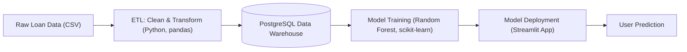

# 💳 SmartCredit-Pipeline: Data Engineering for Loan Eligibility 🏦


---

> **A robust, end-to-end Data Engineering & Machine Learning pipeline for predicting loan eligibility.**

---

## 📑 Table of Contents

- [Introduction](#introduction)
- [Project Architecture](#project-architecture)
- [Key Features](#key-features)
- [Technologies Used](#technologies-used)
- [Setup Instructions](#setup-instructions)
- [How to Run](#how-to-run)
- [Demo / Expected Results](#demo--expected-results)
- [Future Enhancements](#future-enhancements)
- [Acknowledgments](#acknowledgments)

---

## 🏗️ Introduction

This project demonstrates an end-to-end Data Engineering and Machine Learning pipeline for predicting loan eligibility (whether a loan application is approved or denied). It addresses a core problem in the financial industry, showcasing skills from data ingestion and transformation to model deployment and automated orchestration.

---

## 🗺️ Project Architecture



---

## 🚀 Project Goal

The primary objective of this project is to build a robust and reproducible ML pipeline that can:

1. Ingest raw loan application data.
2. Clean and preprocess the data.
3. Train a classification model to predict `Loan_Status` (Approved/Denied).
4. Deploy the trained model via an interactive web application.
5. Automate the entire process using a shell script.

---

## ✨ Key Features

- **Data Ingestion & ETL:** Automated extraction, transformation, and loading of raw data into a PostgreSQL database acting as a mini Data Warehouse.
- **Machine Learning Model:** Development and training of a classification model (Random Forest Classifier) using `scikit-learn` for loan eligibility prediction.
- **Interactive Web Application:** A user-friendly interface built with Streamlit for real-time loan eligibility checks.
- **Pipeline Orchestration:** An automated shell script (`run_pipeline.sh`) to execute the entire ML workflow sequentially.
- **Industry Best Practices:** Adherence to standard folder structure, environment management (Miniconda), and robust error handling.

---

## 🛠️ Technologies Used

- **Language:** Python 3.9+
- **Database:** PostgreSQL
- **DB GUI:** DBeaver
- **Environment:** Miniconda
- **Libraries:** pandas, scikit-learn, SQLAlchemy, psycopg2
- **Web App:** Streamlit
- **Automation:** Bash scripting
- **IDE:** PyCharm

---

## 📂 Project Structure

```
loan_prediction_project/
├── data/
│   ├── raw/                  # Raw, unprocessed datasets (e.g., loan_train.csv)
│   └── processed/            # Cleaned and transformed datasets
├── notebooks/                # Optional Jupyter notebooks for EDA and prototyping
├── src/
│   ├── etl_script.py         # Script for data extraction, cleaning, and transformation
│   ├── train_model.py        # Model training, evaluation, and saving
│   └── app.py                # Streamlit app for loan prediction
├── scripts/
│   └── run_pipeline.sh       # Shell script to run the full ETL + training pipeline
├── models/
│   └── loan_approval_model.pkl # Saved trained model (pickle format)
├── .gitignore                # Files and directories to ignore in Git
└── README.md                 # Project documentation (this file)
```

---

## ⚙️ Setup Instructions

### Prerequisites

- Git
- Miniconda
- PostgreSQL

---

### 1. Clone the Repository

```bash
git clone <your-repository-url>
cd loan_prediction_project
```

### 2. Set Up Conda Environment

```bash
conda create -n loan_pred_env python=3.9
conda activate loan_pred_env
conda install pandas sqlalchemy psycopg2 scikit-learn streamlit
```

### 3. Database Setup

**a. Access PostgreSQL:**

```bash
sudo -i -u postgres psql
```

**b. Create database and user:**

```bash
CREATE DATABASE loan_prediction_db;
CREATE USER loan_pred_user WITH PASSWORD 'L0anP-red#2025!';
ALTER USER loan_pred_user WITH SUPERUSER;
ALTER DATABASE loan_prediction_db OWNER TO loan_pred_user;
\q
exit
```

### 4. Download Dataset

- Go to Kaggle - Loan Prediction Dataset
- Download train_u6lujuX_CVtuZ9i.csv
- Rename and move:

```bash
mv /path/to/train_u6lujuX_CVtuZ9i.csv data/raw/loan_train.csv
```

---

## ▶️ How to Run the Pipeline

```bash
cd loan_prediction_project/
chmod +x scripts/run_pipeline.sh
./scripts/run_pipeline.sh
```

The script will:

- Load data to PostgreSQL.
- Train and save the model.
- Launch Streamlit web app at http://localhost:8501.

Stop the app using Ctrl+C.

---

## ✅ Demo / Expected Results

After running the pipeline:

- **ETL:** Data is loaded into `loan_prediction_db`, table `loan_applications`.
- **Model Training:** Classification report with ~82% accuracy printed, model saved as .pkl.
- **Streamlit App:** Use form to input applicant data and check eligibility.

> _This applicant is very likely to be denied due to low income, high loan request, poor credit history, and lack of co-applicant._

---

## 🔮 Future Enhancements

- Model Improvements: Add XGBoost, LightGBM, feature engineering, and tuning.
- Validation: Add data quality checks in ETL.
- Monitoring: Track model performance over time.
- Containerization: Use Docker for consistent deployment.
- CI/CD: Automate testing and deployment.
- Cloud: Move to AWS/GCP/Azure for scalability.

---

## 🙌 Acknowledgments

Thanks to the open-source community and contributors of:

- Kaggle datasets
- Streamlit
- scikit-learn
- PostgreSQL
